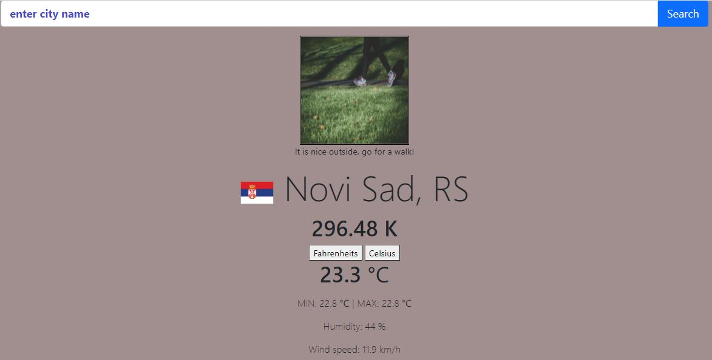

# To-Do App

## Description

In this project I built a to do app using plain JavaScript.You can make a new project and inside each project make a task, you can set the task priority and due dates.
You can also delete each task or project.I used LocalStorage for storing the data and uuid for generating random id's.

## Built With

- JavaScript
- Webpack
- Bootstrap

## Set up this project locally

- Open the terminal in the directory where you want to install the app;
- Run command `https://github.com/MarkoNS1990/to_do_app` which will clone the project;
- Switch to the main directory of project using cd;
- Run `npm/yarn install webpack webpack-cli --save-dev` in your computer terminal to install Webpack (you will need Node.js installed on your machine);
- Open index.html file in your browser;
- Use it.

## Screenshot

### Deployment

This application is deployed on [GitHubPages](https://markons1990.github.io/to_do_app/).

## Author

👤 **Marko Zecevic**

 

## 🤝 Contributing

Contributions, issues, and feature requests are welcome!

If you want to contribute, you can clone this project or fork it.

If you found an issue, feel free to check the [issues page](https://github.com/MarkoNS1990/to_do_app/issues).

## Show your support

Give a ⭐️ if you like this project!

## Acknowledgments

- [Microverse](https://www.microverse.org/)
